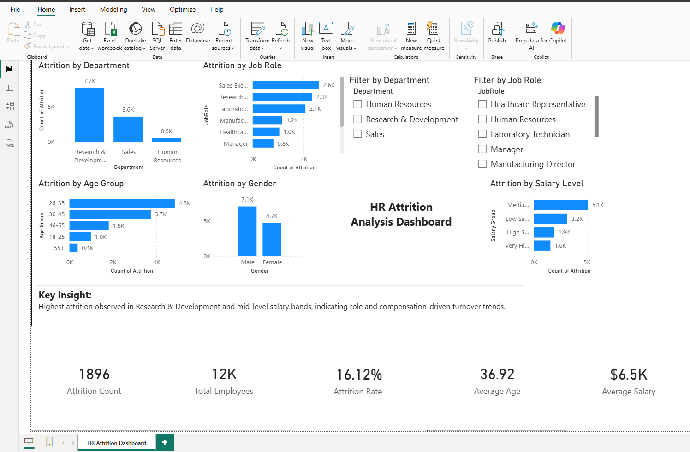

# Organizational KPI Dashboard and Performance Analytics Platform (Power BI) 

## Overview

This project presents an interactive HR analytics dashboard built using Power BI to analyze employee attrition trends and identify key drivers of turnover.

## Dataset

* IBM HR Analytics Employee Attrition dataset
* Includes employee demographics, job roles, salary, and attrition status

## Key Metrics

* Total Employees: 12K
* Attrition Count: 1,896
* Attrition Rate: 16.12%
* Average Salary: $6.5K
* Average Age: 36.9

## Key Insights

* Highest attrition observed in Research & Development department
* Sales shows moderate attrition, while HR has the lowest
* Employees aged 26–35 contribute most to attrition
* Mid-level salary bands show higher turnover than high-income groups
* Slightly higher attrition among male employees

## Dashboard Features

* KPI cards for quick overview
* Attrition analysis by Department and Job Role
* Breakdown by Age Group, Gender, and Salary Level
* Interactive filters for deeper analysis

## Tools Used

* Power BI
* DAX
* Data Visualization

## Dashboard Preview

